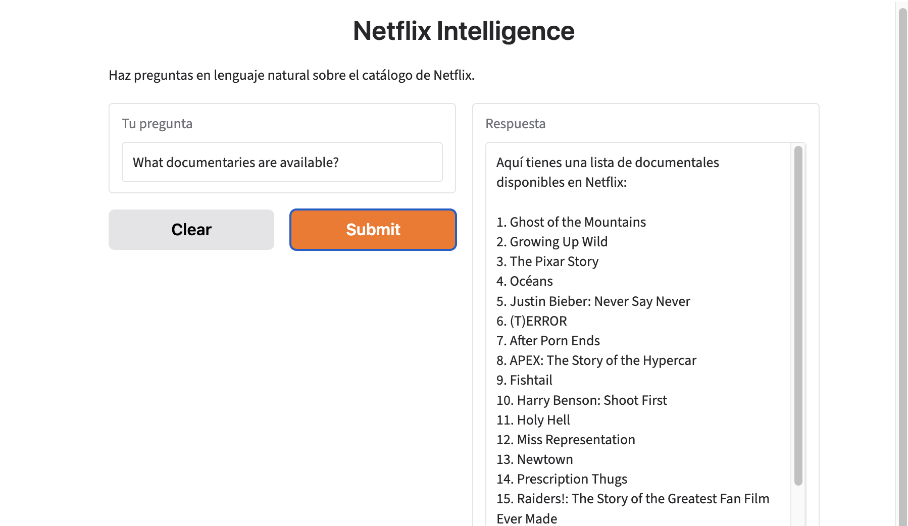

# Netflix Intelligence — Text-to-SQL LLM App

**Ask your data questions in plain language. Get answers straight from the database.**



---

## The business problem

In most companies, business users can't query their own data. Every question — *how many, which ones, since when* — goes to an analyst who writes SQL. The result: delays, analyst bottlenecks, and decisions made without data.

This app removes that step. A manager types a question in natural language; the app writes the SQL, runs it against the data warehouse, and answers conversationally — including follow-up questions.

The dataset here is a public Netflix catalog (8,800+ titles), but the pattern applies to any structured business data: sales, inventory, customers, orders.

## What it does

- **Natural-language questions** → *"How many documentaries are there?"*, *"Which Indian movies were released after 2018?"*
- **SQL generated and executed automatically** on Google BigQuery
- **Conversational memory** → follow-ups like *"Which of those would you recommend for kids?"* use the context of the session
- **Web interface** usable from any device, no technical knowledge required

## Architecture

```
User question (plain language)
        │
        ▼
┌───────────────────────┐
│ 1. Text-to-SQL engine │  OpenAI gpt-4o-mini via LangChain
│    schema-aware prompt│  + dataset-specific rules
└──────────┬────────────┘
           ▼
┌───────────────────────┐
│ 2. Guardrails         │  read-only (SELECT only), row cap
└──────────┬────────────┘
           ▼
┌───────────────────────┐
│ 3. Data layer         │  Google BigQuery
└──────────┬────────────┘
           ▼
┌───────────────────────┐
│ 4. Answer layer       │  LLM turns raw results into a clear answer,
│    + memory           │  using session history (SQLChatMessageHistory)
└──────────┬────────────┘
           ▼
     Gradio web interface
```

## Key design decisions

| Decision | Why |
|---|---|
| **Text-to-SQL instead of RAG** | The data is structured (rows and columns). Generating SQL gives exact counts and filters; retrieving text chunks would not. |
| **gpt-4o-mini, temperature 0** | Low cost per query and fast responses; SQL generation needs consistency, not creativity. |
| **Schema + rules in the prompt** | Columns like `country`, `cast` and `listed_in` hold comma-separated values. Explicit rules (`LIKE '%value%'`, exact values for `type`) fixed the most common query errors. |
| **Two LLM calls (generate SQL → explain results)** | Separates *getting the right data* from *communicating it well*. |
| **Read-only guardrail + row cap** | The model can only run `SELECT` queries, and lists are capped at 20 rows to control cost and response size. |
| **Secrets outside the code** | The OpenAI key lives in Colab Secrets; Google Cloud access uses OAuth authentication. |

## What I would add for production

- **Follow-ups at the SQL level:** today memory is used when phrasing the answer; passing history into the SQL step would let follow-ups refine the query itself (e.g. *"and only from the US?"*).
- **Evaluation set:** a list of test questions with expected answers to measure accuracy before each change.
- **Semantic layer:** business definitions (e.g. what counts as "recent") so answers are consistent across users.
- **Access control and logging:** per-user permissions and an audit trail of generated queries.
- **Persistent hosting:** deploy on Hugging Face Spaces or Cloud Run instead of a notebook.

## Tech stack

Python · LangChain · OpenAI gpt-4o-mini · Google BigQuery · Gradio · SQLite (session memory) · Google Colab

## How to run it

1. Open `netflix_text_to_sql.ipynb` in Google Colab.
2. Add your `OPENAI_API_KEY` in **Colab Secrets** (key icon in the left sidebar).
3. Load the [Netflix titles dataset](https://www.kaggle.com/datasets/shivamb/netflix-shows) into a BigQuery table and update the project/table name in the notebook.
4. Run all cells. The last cell launches the web interface with a public link.

## How it was built

I'm a business executive, not a software engineer. I designed this solution, directed the build with an AI pair-programmer, and took it end to end — from a blank notebook to a live web app across three cloud platforms. Along the way I worked through the real obstacles of shipping an LLM application: authentication across services, token limits, schema mismatches and prompt calibration.

That is how I work with AI: define the business problem, design the system, direct the build, and validate that it actually works.

---

**Santiago Molina Rojas** · [LinkedIn](https://www.linkedin.com/in/santiagomolinarojas) · [GitHub](https://github.com/santiagomolinarojas)
